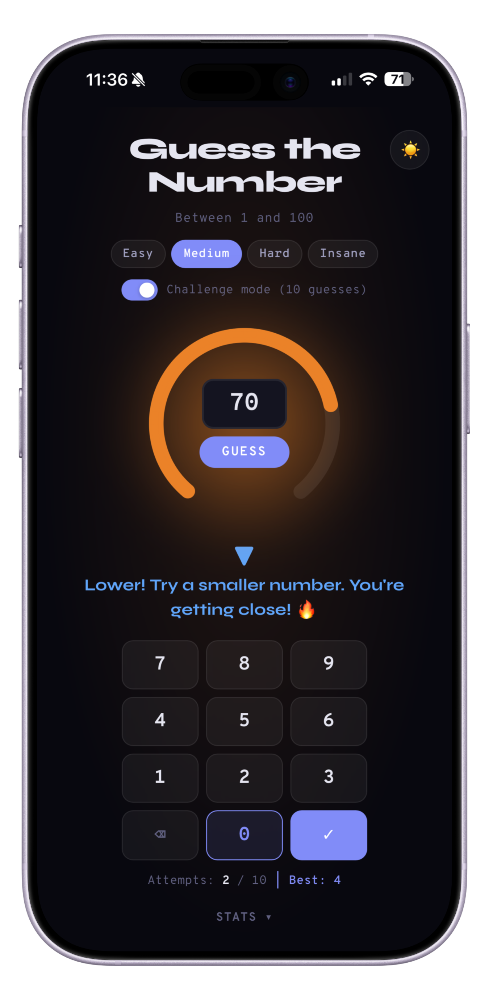
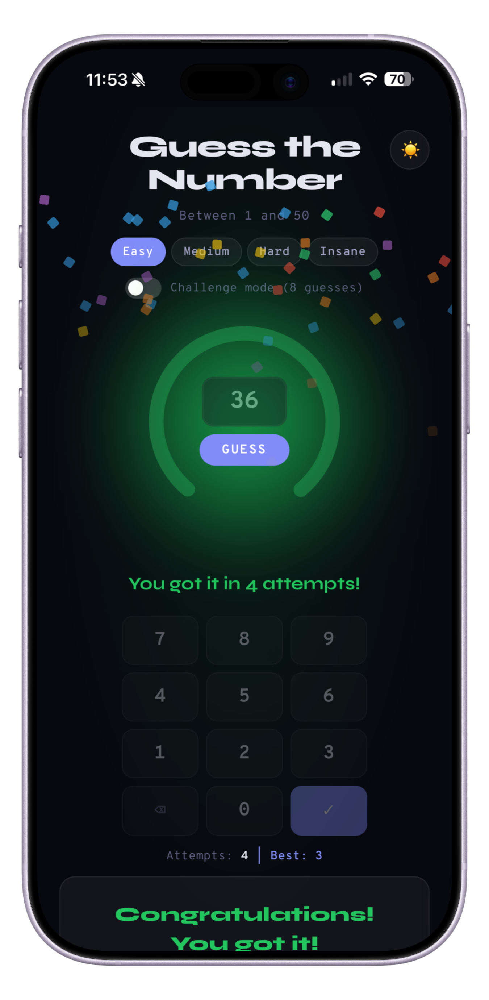

# Number Guessing Game

A playable number guessing game — and an experiment in agentic, ticket-first development.

## Motivation

Number guessing was one of the first programs I wrote on a Commodore C64 — so it felt like a fitting domain for exploring what agentic, AI-assisted development looks like. The domain is intentionally simple so the focus stays on the *process*: every feature starts as a ticket, work is organized into epics, and UI polish is iterated incrementally with AI assistance.

## Features

- **Difficulty levels** — Easy, Medium, Hard, and custom ranges
- **Challenge mode** — limited guesses add pressure
- **Heat gauge** — visual hot/cold feedback as you close in on the number
- **Custom numpad** — touch-friendly input, no system keyboard required
- **Dark mode** — auto-detects system preference
- **Stats** — tracks games played, wins, and best scores
- **PWA** — installable, works offline

## Screenshots

| Guessing | Victory |
|----------|---------|
|  |  |

## Tech

- Vanilla JS (no frameworks)
- [esbuild](https://esbuild.github.io/) for bundling
- [Vitest](https://vitest.dev/) for unit tests
- PWA via Web App Manifest + Service Worker

## Getting Started

```bash
npm install
npm run build
open dist/index.html
```

## Development

```bash
npm test              # run tests once
npm run test:watch    # run tests in watch mode
```
